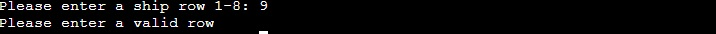
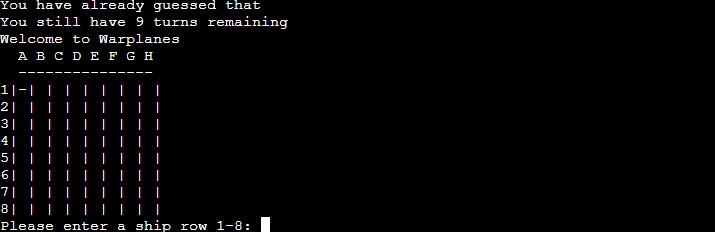
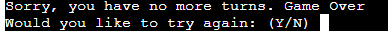
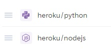

# Warplanes

## Warplanes is a Python terminal game, which runs in the Code Institute mock terminal on Heroku.
### In my country, we would play the pen-and-paper game "Warplanes". Same game as "Battleship", but with planes. 

## How to Play

In this version of the game, the objective is to shoot 5 warplanes out of the sky. When the player starts the app, he will be able to see the board, but not the warplane placement onto that board. 
The board is 8x8. Rows 1 to 8 and columns A to H. The player has 10 tries, before the game is over. 
## Features
  
 * Random generated planes onto the board with each new game
 * The player doesn't see where the planes are placed

 * Accepts user input
 * Hits are marked with "X" and miss with "-"

 
 
 
 

 * After each row and column input, the player is reminded of how many turns he has left
 * You cannot enter a value outside the grid

 

 
 

 * If you repeat the same input, you will not get punished for it, thus you will not loose a turn

 

 * If the 5 warplanes haven't been shot out of the sky within the 10 turns, the game is over

 

 * UPDATED with "Try Again" after finishing the game. The player has the option to either start a new game, by pressing "y" or stop playing by pressing "n"

 

  * Python allows us to set up signal -handlers so when a particular signal arrives to our program we can have a behavior different from the default. 
    * For example when you run a program on the terminal and press Ctrl-C the default behavior is to quit the program.

 

 
 ## Testing

 * The code has been passed through PEP8 - results found: "All right"

 * The app has been tested localy and on the Heroku terminal

 ## Bugs

 * A line in the code block did not follow consistent indenting, thus generating a SyntaxError

 

 * When not entering any value, game would break

 

 ## Remaining Bugs

 * Bugs have been fixed prior deployment

 ## Deployment Steps

 * Code Institute Mock Terminal has been forked
 * Create the Heroku app
 * Buildpacks have been set, as per instructions

 

 ## UPDATE ON DEPLOYMENT (17th of May, 2022)

* Due to a security issue, Heroku has disabled automated deployments from GitHub. In order to deploy, the next steps were used:
 
   * Enter the following command in the terminal: heroku login -i
   * Enter the following command in the terminal: heroku apps
   * Enter the following command in the terminal: heroku git:remote -a <app_name>
   * Enter the following command in the terminal: git add . && git commit -m "Deploy to Heroku via CLI"
   * Enter the following command in the terminal: git push origin main
   * Enter the following command in the terminal: git push heroku main

 ## Credits

 * This project uses the [Code Institute student template](https://github.com/Code-Institute-Org/python-essentials-template) for deploying the third portfolio project, the Python command-line project.
 * Code Institute's ["Ultimate Battleships"](https://p3-battleships.herokuapp.com) inspired the README section and ["Warplanes"](https://warplanes.herokuapp.com) app
 * Code Institute's help on how to push the program manually from GitHub to Heroku
